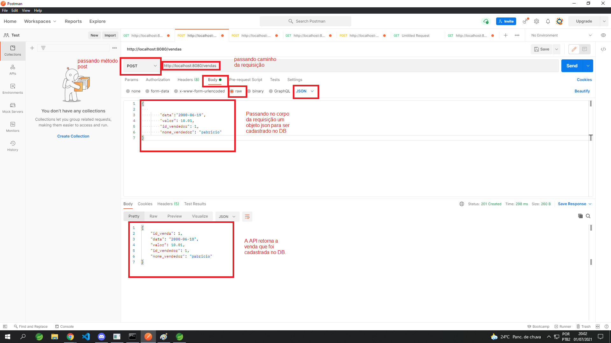

"# desafio_criando_api" 
Para testa api: há uma arquivo chamado teste.jar é só executa ele no termina que api estára online para testa a primeira parte do desafio que é criar uma vendas usei Postman com metodo POST. 

    

Passando esses parametros no body 
{
        "data":"2000-06-19",
        "valor": 10.01,
        "id_vendedor": 1,
        "nome_vendedor": "pabricio"
}
